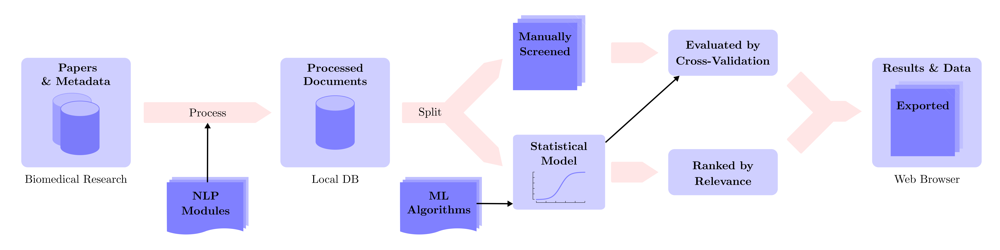
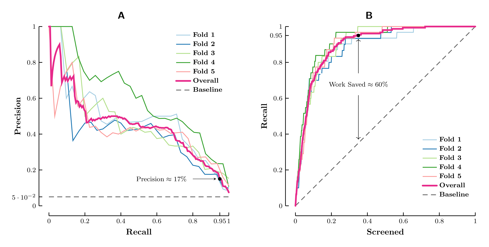

# Longevity Research Screening

**A Simple Machine Learning Framework for Citation Screening of Aging and Longevity Research Studies**

<p align="center">

</p>

## Introduction

This repository contains the source code of a research project to develop a machine learning framework to semi-automate citation screening in systematic reviews and meta-analyses.

The framework was developed and evaluated in context of aging and longevity research studies and tested on a particular dataset related to "Dasatinib and Quercetin Senolytic Therapy Risk-Benefit Analysis" (D&Q Analysis) published by <ins>[Forever Healthy Foundation](https://brain.forever-healthy.org/display/EN/)</ins>. The results are in 3 interactive tables of exported documents accessible <ins>[here](https://markolalovic.com/longevity-research-screening/)</ins>.

You can find the tech report <ins>[here](https://zenodo.org/record/4603365/files/zenodo.4603365.pdf)</ins> or check the presentation <ins>[slides](https://zenodo.org/record/4603371/files/slides.pdf)</ins> for a quick overview.

---

## Evaluation Results

The empirical results show that the proposed system can identify 95% of relevant documents on average with 17% precision. The overall performance of the system is reasonable,
since the reviewers have to screen only around 35% of retrieved documents on average to achieve the desired 95% recall. This saves them around 60% of work comparing to random screening where they would need to screen 95% of documents on average to achieve the desired 95% recall.

Below are the results we got on D&Q Analysis dataset tested on 153 labeled documents using 5-fold cross-validation procedure.

| Fold | Precision | Recall | PR-AUC  | WSS@R |
| ---- |:---------:|:------:|:------:|:-----:|
| 1 | 0.13 | 0.94 | 0.54 | 0.53 |
| 2 | 0.16 | 0.90 | 0.33 | 0.61 |
| 3 | 0.14 | 1.00 | 0.48 | 0.63 |
| 4 | 0.19 | 0.94 | 0.54 | 0.67 |
| 5 | 0.20 | 0.97 | 0.43 | 0.71 |

Below are PR-Curves and WSS@R-Curves we got on D&Q Analysis dataset.

<p align="center">

</p>


## Installation

The code is tested with Ubuntu 20.04.1 LTS. The framework is implemented in Python and uses JavaScript for the font-end. In './src' directory is a `Makefile` that creates Python virtual environment in `./src/longevity-research-screening-venv` and installs all the dependencies from `./src/requirements.txt`.

## Usage
Below is an overview of the proposed framework.

<p align="center">

</p>

### Running the Model
To reproduce the experimental results one can use the `Makefile` in `./src/`.

For the results of a simple model that uses only binary features, run:
```bash
cd src
make run
```

You should see the results and updated plots in `figures` directory.

The full model uses extracted features from LDA topic model constructed using Java-based package for statistical natural language processing called `Mallet`. To build `Mallet` you need to have Java and Apache `ant` build tool installed. On Debian based distro, run:
```bash
sudo apt-get install default-jdk
sudo apt-get install ant
```

Then simply run `make full` which also downloads `Mallet` to `./src`:
```bash
cd src
make full
```

### Pre-processing
The framework uses a local MySQL database. To re-run the pre-processing steps you need to have mysql server installed. On Debian based distro, run:
```bash
sudo apt install mysql-server
```

Then import the database dump (5.4 MB) of the dataset for D&Q Analysis: <ins>[longevity_research.sql](https://zenodo.org/record/4593916/files/longevity_research.sql)</ins> into the local MySQL database.

Then, to execute all the pre-processing steps, run:
```bash
python3 preprocess_articles.py
```


### Creating a Dataset
Besides mysql server you need to also have `chromedriver` tool for web-scraping. On Debian based distro you can download the latest release of `chromedriver` to `.src` directory by running `get_chromedriver.sh` script in `src` dir:
```bash
cd src
./get_chromedriver.sh
```

Then, to re-create the dataset for D&Q Analysis, run the Python script `create_database.py`:
```bash
python3 ./src/create_database.py
```

The script queries PubMed database with provided search terms devised by Forever Healthy foundation using `pymed` API. Additionally, it scrapes some data directly from websites of journals or clinical trials (Clinical-
Trials.gov) using `chromedriver`. The script creates a database called `longevity_research`. The retrieved data is saved into `longevity_research` database in `dasatinib_and_quercetin_senolytic_therapy` table.

It takes some time for the script to finish since it waits a certain time interval between calling get, to avoid to many requests in short time. The script prints the estimated time for scraping when started.

## Citing this Work
If you find this work useful, please cite:
```
Lalović, Marko. (2021, March 10). A Simple Machine Learning Framework for Citation Screening of Aging and Longevity Research Studies. Zenodo. http://doi.org/10.5281/zenodo.4603365
```
Or by using [bib entry](https://zenodo.org/record/4603365/export/hx#.YE09jvtKhH4).

## License
The code is released under MIT License. See the LICENSE file for more details.
